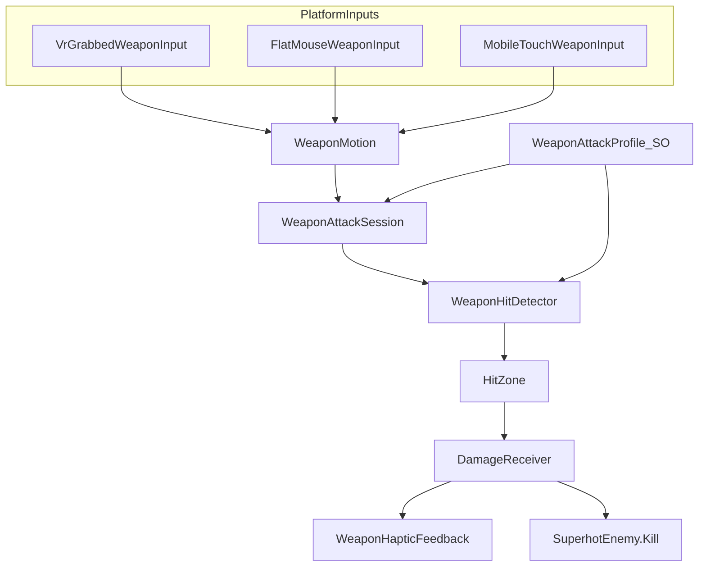

# VR 근접 무기 시스템 구현 계획

## 현재 상태

| 영역 | 있음 | 없음 |
|------|------|------|
| XR 그랩 | XRI 3.4.0 `XRGrabInteractable` ([`CrystalDefenseGrabbableDamage.cs`](Project/Assets/_Project/Presentation/Gameplay/CrystalDefenseGrabbableDamage.cs)) | 잡은 무기 전용 프리팹/컴포넌트 |
| 속도 기반 데미지 | 던지기용 `linearVelocity`만 | 각속도, 공격 세션, 베기/찌르기 분류 |
| 피격 | [`SuperhotEnemy.Kill()`](Project/Assets/_Project/Presentation/Gameplay/SuperhotEnemy.cs), [`OsFpsInspiredDamageable`](Project/Assets/_Project/Presentation/OsFpsInspired/OsFpsInspiredDamageable.cs) | `HitZone`, `DamageReceiver`, 중복 히트 가드 |
| 햅틱 | [`CrystalDefenseVrFeedback`](Project/Assets/_Project/Presentation/Gameplay/CrystalDefenseVrFeedback.cs) (게임 이벤트) | 무기 타격 전용 햅틱 |
| 설정 | Inspector `[SerializeField]` | `ScriptableObject` 무기 프로필 |
| 테스트 | EditMode 21개 ([`OsFpsInspiredWeaponThrowGateTests`](Project/Assets/_Project/Tests/EditMode/OsFpsInspiredWeaponThrowGateTests.cs) 패턴) | 전투/근접 테스트 0 |

**확정된 설계 선택 (사용자 응답):**
- 적 피격 = **즉사** (`SuperhotEnemy.Kill`) — HP 감소가 아니라 유효 타격 시 Kill
- 플랫폼 = **VR + 모바일 + 키보드/마우스** — 공통 파이프라인 + 입력 어댑터

---

## 목표 아키텍처



**책임 분리 (제안 구조 그대로):**

| 컴포넌트 | 역할 |
|----------|------|
| `WeaponMotion` | FixedUpdate마다 tip/handle Transform 샘플 → 선속도·각속도·스윙 방향 벡터 |
| `WeaponAttackProfile` (SO) | 무기 타입(Slash/Stab/Blunt), 최소/기준 속도, 방향 dot 임계값, 피드백 강도 |
| `WeaponAttackSession` | 스윙 시작/종료 상태 머신, `SessionId` 발급 |
| `WeaponHitDetector` | Trigger 충돌, 세션·속도·방향 검증, 중복 히트 차단 |
| `HitZone` | 부위 종류(Head/Torso/Limb/Shield), 즉사 여부·피드백 배율 |
| `DamageReceiver` | 유효 히트 시 `SuperhotEnemy.Kill` + 이벤트 발행 |
| `WeaponHapticFeedback` | 타격 강도·부위별 햅틱/사운드/VFX |

**순수 로직 (Application 레이어, Unity 무의존):**  
[`SuperhotTimeScaleCalculator`](Project/Assets/_Project/Application/Gameplay/SuperhotTimeScaleCalculator.cs)와 동일 패턴으로 테스트 가능한 static 클래스 분리.

```
Application/Combat/
  WeaponMotionSample.cs          // ring buffer 샘플 → speed/angularSpeed
  WeaponAttackSessionLogic.cs    // enter/exit threshold
  WeaponAttackKindClassifier.cs  // slash/stab/blunt dot 판정
  MeleeHitValidator.cs           // min speed + kind + session active
  DuplicateHitGuard.cs           // (sessionId, target, zone) + cooldown
```

---

## 구현 순서 (사용자 제안 순서 + 멀티플랫폼 보강)

### Phase 1 — 무기 잡기 (Grab)

**목표:** VR에서는 XRI로 물리 무기를 잡고, Flat/Mobile에서는 "장착 무기" 모드로 동일 컴포넌트 트리 사용.

- 새 프리팹 `MeleeWeapon_Sword` (또는 기존 HK416 옆 테스트용 칼):
  - `Rigidbody` + `XRGrabInteractable` (Movement Type: Instantaneous 또는 Velocity Tracking — **테스트 후 확정**)
  - 자식 `BladeTip` / `Handle` Transform
  - `BoxCollider` (isTrigger) on blade
- **플랫폼 어댑터** `IWeaponMotionSource`:
  - `VrGrabbedWeaponMotionSource` — grab 시 interactor attach point 또는 weapon root 추적
  - `FlatMouseWeaponMotionSource` — 마우스 delta + WASD 이동을 weapon tip 가상 속도로 변환 (Flat playtest rig 연동)
  - `MobileTouchWeaponMotionSource` — 터치 드래그 속도 (Galaxy Tab S7 FE 타겟, [`overall-game-design.md`](docs/superpowers/specs/2026-05-26-overall-game-design.md) 모바일 UI와 병행)
- 씬: [`UnityChanPrototypeFps.unity`](Project/Assets/Scenes/UnityChanPrototypeFps/UnityChanPrototypeFps.unity)에 스폰 메뉴 추가 ([`UnityChanPrototypeFpsSceneMenu.cs`](Project/Assets/_Project/Editor/UnityChanPrototypeFpsSceneMenu.cs))

**주의:** XRI grab 중 Rigidbody가 kinematic이면 `linearVelocity`가 0일 수 있음 → **Transform 델타 기반** `WeaponMotion`이 필수 ([`CrystalDefenseGrabbableDamage`](Project/Assets/_Project/Presentation/Gameplay/CrystalDefenseGrabbableDamage.cs)의 velocity-only 방식은 held weapon에 부적합).

---

### Phase 2 — WeaponMotion (속도/각속도)

```csharp
// Application/Combat/WeaponMotionSample.cs (개념)
public readonly struct WeaponMotionState {
  public float LinearSpeedMps;
  public float AngularSpeedDps;
  public Vector3 TipVelocity;      // world
  public Vector3 SwingDirection; // normalized tip delta
  public Vector3 WeaponForward;
}
```

- `WeaponMotion` MonoBehaviour: `IWeaponMotionSource`에서 pose 읽기 → ring buffer (최소 3~5 FixedUpdate) → `WeaponMotionState` 노출
- `SuperhotTimeScaleCalculator.AngularSpeedDegreesPerSecond` 재사용 가능
- EditMode 테스트: 고정 delta 시퀀스로 speed/angular 계산 검증

---

### Phase 3 — 공격 세션 (WeaponAttackSession)

- `WeaponAttackSessionLogic` (pure):
  - **Enter:** `LinearSpeed >= enterLinear` OR `AngularSpeed >= enterAngular`
  - **Exit:** 둘 다 `exit` 이하 N 프레임 연속 OR `maxSessionDuration`
  - 세션 시작 시 `SessionId++`
- `WeaponAttackSession` MonoBehaviour: 매 FixedUpdate `WeaponMotion` 읽고 상태 전환
- `IsActive`, `CurrentSessionId`, `ActiveKind`(Phase 5에서 채움) 프로퍼티

---

### Phase 4 — HitZone (부위)

적 루트에 `DamageReceiver`, 자식 collider에 `HitZone`:

```
EnemyRoot
  DamageReceiver
  SuperhotEnemy
  HitZone_Head   (trigger, multiplier=1.5, feedback only)
  HitZone_Torso
  HitZone_Limb
```

**즉사 모델:** 모든 유효 HitZone → `SuperhotEnemy.Kill(hitPoint, normal)`  
부위 차이 = 햅틱 amplitude, shard VFX scale, 사운드 pitch (데미지 배율 아님)

- `HitZone.Resolve(Collider)` → zone kind + feedback multiplier
- Layer: `Enemy` + `WeaponHit` 분리 (Project Settings Tags/Layers)

---

### Phase 5 — 베기/찌르기/둔기 판정 분리

`WeaponAttackKindClassifier` (pure, dot product):

| Kind | 조건 (예시) |
|------|-------------|
| **Stab** | `dot(tipVelocity, weaponForward) >= stabForwardDotMin` && angular < bluntMaxAngular |
| **Slash** | `dot(tipVelocity, weaponRight) >= slashSideDotMin` && linear >= slashMinLinear |
| **Blunt** | profile.WeaponFamily == Blunt OR (linear high && angular low && forward dot low) |

- `WeaponAttackProfile`에 kind별 `minLinear`, `minAngular`, dot threshold
- 세션 active 중 **dominant kind** 갱신 (매 프레임 재계산, 히트 순간 스냅샷 사용)
- kind가 profile 허용 목록에 없으면 히트 무효

---

### Phase 6 — “데미지” 공식 → 즉사 qualifying hit

HP 대신 **Qualifying Hit Score** (0~1)로 최소 타격 품질 게이트:

```
score = Motion01(linearSpeed) * kindWeight * zoneFeedbackMul
valid = sessionActive && score >= profile.minQualifyingScore && kindAllowed
```

- valid → `DamageReceiver.ReceiveHit(context)` → `SuperhotEnemy.Kill`
- `MeleeHitValidator` + `MeleeDamageCalculator` 이름은 유지하되 출력은 `float qualifyingScore` (EditMode 테스트)

---

### Phase 7 — 중복 히트 방지

[`CrystalDefenseGrabbableDamage`](Project/Assets/_Project/Presentation/Gameplay/CrystalDefenseGrabbableDamage.cs) 패턴 확장:

```csharp
// DuplicateHitGuard (pure)
bool TryRegisterHit(int sessionId, int targetId, int zoneId, float time, float cooldownSec)
```

- 동일 `(sessionId, target, zone)` → 1회만
- 동일 target 전역 cooldown (`profile.perTargetCooldownSec`, 기본 0.15~0.25s)
- `WeaponHitDetector.OnTriggerEnter`에서 guard 통과 후에만 `DamageReceiver` 호출

---

### Phase 8 — 방패/패링

**후순위지만 인터페이스는 Phase 4에서预留:**

- `HitZoneKind.Shield` + `ShieldBlocker`:
  - 무기 접근 방향 vs shield normal dot 검사
  - block 성공 → 히트 취소, `OnBlocked` 이벤트
- `ParryWindow`:
  - block 직후 `parryWindowSec` 내 고속 counter swing → 적 stun 또는 즉사 보너스 (즉사 모델이면 stun/VFX만)
- VR: shield grabbable prefab / Flat·Mobile: Q 또는 UI 버튼 hold

---

### Phase 9 — 햅틱/사운드/이펙트

- `WeaponHapticFeedback`: [`CrystalDefenseVrFeedback.Pulse`](Project/Assets/_Project/Presentation/Gameplay/CrystalDefenseVrFeedback.cs) static 메서드 **추출** → `VrHapticChannel` 공용 유틸
  - VR: grab한 손 `XRNode`만 pulse
  - Mobile/Flat: 햅틱 skip, screen shake / UI flash 대체 (기존 screen impulse spec 참고)
- `DamageReceiver.OnHitConfirmed` → AudioSource + optional `GlassShardBurst` at contact
- kind/zone별 profile tuning (amplitude, clip, VFX prefab)

---

### Phase 10 — ScriptableObject 튜닝

초기 Phase 1~7은 `[SerializeField]` fallback으로 빠르게 붙이고, **Phase 10에서 SO로 이전**:

```csharp
[CreateAssetMenu(menuName = "VR Project/Combat/Weapon Attack Profile")]
public sealed class WeaponAttackProfile : ScriptableObject {
  public WeaponFamily family;
  public float enterLinearSpeed, exitLinearSpeed;
  public float enterAngularSpeed, exitAngularSpeed;
  public float stabForwardDotMin, slashSideDotMin;
  public float minQualifyingScore;
  public float perTargetCooldownSec;
  // haptic/audio refs
}
```

- Sword / Knife / BluntHammer / Shield 프로필 asset 3~4개
- `WeaponHitDetector` + `WeaponAttackSession`이 profile 참조

---

## 파일 배치

```
Project/Assets/_Project/
  Application/Combat/           ← pure logic (신규)
  Presentation/Combat/          ← MonoBehaviour + SO (신규)
  Tests/EditMode/Combat/        ← NUnit (신규)
  Editor/UnityChanPrototypeFpsSceneMenu.cs  ← SpawnMeleeWeapon 메뉴
```

네임스페이스: `VRProject.Application.Combat`, `VRProject.Presentation.Combat`

**기존 코드와의 관계:**
- `CrystalDefenseGrabbableDamage` — **던지기 전용 유지**, melee weapon에는 미사용
- `OsFpsInspiredWeapon` — **총기 hitscan 유지**, melee는 별 prefab (gun + sword 공존)
- `SuperhotFlatHitscanWeapon` — Flat 즉사 레이캐스트 유지, melee motion source가 병행

---

## 테스트 전략 (TDD)

각 Phase마다 **pure logic 먼저 RED → GREEN**:

| 테스트 클래스 | 검증 |
|---------------|------|
| `WeaponMotionSampleTests` | ring buffer speed/angular |
| `WeaponAttackSessionLogicTests` | enter/exit/hysteresis |
| `WeaponAttackKindClassifierTests` | stab/slash/blunt 벡터 케이스 |
| `MeleeHitValidatorTests` | min score, kind gate |
| `DuplicateHitGuardTests` | session/target/zone/cooldown |
| `DamageReceiverTests` | valid hit → Kill 호출 (mock `SuperhotEnemy`) |

Play Mode / VR 실기 테스트는 Quest 3 + Editor XR Simulation + Flat 마우스로 수동 체크리스트.

---

## 씬·프리팹 통합

1. `MeleeWeapon` prefab → `Assets/_Project/Presentation/Combat/Prefabs/`
2. Editor: `VR Project/Scenes/Spawn Melee Weapon in UnityChanPrototypeFps`
3. 기존 enemy prefab/씬 인스턴스에 `HitZone` collider 2~3개 추가
4. Unity MCP `validate_script` + `read_console` ([`.cursor/rules/unity-mcp-vr-refactor.mdc`](.cursor/rules/unity-mcp-vr-refactor.mdc))

---

## 리스크 & 완화

| 리스크 | 완화 |
|--------|------|
| Kinematic grab → velocity 0 | Transform delta 기반 motion (Phase 2) |
| Trigger tunneling at high speed | `Rigidbody.interpolation`, blade collider Continuous Speculative, tip 다중 샘플 |
| 3플랫폼 입력 불일치 | `IWeaponMotionSource` + profile별 threshold 분리 (VR stricter, flat looser) |
| 즉사 + 중복 guard 없음 | Phase 7 필수, guard 없이 Phase 6 merge 금지 |

---

## 완료 기준 (Definition of Done)

- VR: 칼 grab → 휘두르기 → 적 즉사 + 손 햅틱 + shard VFX
- Flat: 마우스 휘두르기로 동일 Kill 파이프라인
- Mobile: 터치 스와이프로 동일 Kill 파이프라인
- EditMode Combat 테스트 전부 green
- `WeaponAttackProfile` SO 3종 + Inspector fallback 제거
- `CrystalDefenseGrabbableDamage` / gun hitscan 회귀 없음
